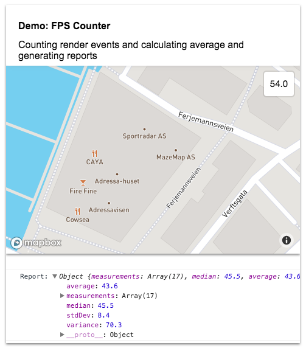

# Mapbox GL FPS

A frames-per-seconds measurer and GUI control




## Classes

* class `FPSMeasurer` - An non-dependent class for measuring FPS and calculating stats.
* class `FPSControl` - A MapBox GL GUI Control


## Example with GUI Control

```js
var fpsControl = new MapboxFPS.FPSControl();
myMap.addControl(fpsControl, 'top-right');

setTimeout(function(){
    var report = fpsControl.measurer.getMeasurementsReport();
    console.log('Report:', report);
}, 10000)
```


## Example with standalone class

```js
var fpsMeasurer = new MapboxFPS.FPSMeasurer();

fpsMeasurer.startMeasuring();

// Measure 'mock render frames' every 20 ms for 2 seconds
var interval = setInterval( () => { measurer.registerRenderFrame() }, 20);

setTimeout( () => {
  // Stop the mock frame render interval
  clearInterval(interval);

  // Stop measuring
  fpsMeasurer.startMeasuring();

  // Generate report
  var report = measurer.getMeasurementsReport();
  console.log('Report: ', report);

}, 2000);

```

## Generate Report

```js
var fpsMeasurer = new MapboxFPS.FPSMeasurer();
var report = measurer.getMeasurementsReport();
```

returns an object:


```js
// generated report
{
  "measurements": [...], // Array of actual measurements done
  "median": Number,
  "average": Number,
  "variance": Number,
  "stdDev": Number
}
```